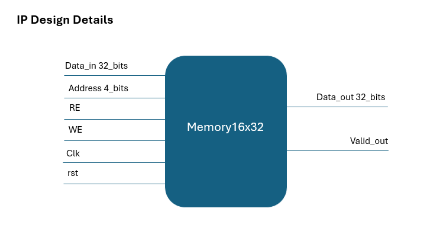

# Memory_Verification_using_UVM-based_Environment

This project focuses on verifying a single-port memory design (16x32) using a UVM-based verification environment written in SystemVerilog. The main goal is to ensure correct functionality of all memory operations including read, write, reset, and boundary conditions using an organized and reusable verification structure.

### Project Overview:

* Memory model: 16x32 single-port RAM
* Verification method: UVM (Universal Verification Methodology)
* Language: SystemVerilog
* Simulator: QuestaSim

### Files Included:

* memory16x32.sv : Design Under Test (DUT) – Memory module
* interface.sv    : Interface connecting DUT with UVM components
* top.sv          : Top module that instantiates DUT and UVM environment
* UVM environment files (my_driver, my_monitor, my_agent, my_scoreboard, my_env, my_test, etc.)

### Verification Features:

* Random and directed test sequences
* Write and Read operation verification
* Reset functionality checking
* Scoreboard comparison (Expected vs Actual)
* Functional and code coverage tracking

### Tools Used:

* SystemVerilog
* QuestaSim
* UVM

## Memory Interface & Functionality

### Input Ports:

| Port Name | Size    | Description                                    |
| --------- | ------- | ---------------------------------------------- |
| Data_in   | 32 bits | Data input bus for write operations            |
| Address   | 4 bits  | Address bus specifying memory location         |
| RE        | 1 bit   | Read enable signal (active high)               |
| WE        | 1 bit   | Write enable signal (active high)              |
| Clk       | 1 bit   | System clock signal for synchronous operations |
| rst       | 1 bit   | Active-low asynchronous reset (initialization) |

### Output Ports:

| Port Name | Size    | Description                         |
| --------- | ------- | ----------------------------------- |
| Data_out  | 32 bits | Data output bus for read operations |
| Valid_out | 1 bit   | Indicates that Data_out is valid    |

### Functional Description:

**Write Operation:**
On the rising edge of the clock, when the Write Enable signal (WE) is asserted, the data present on Data_in is written into the memory location specified by the Address input.

**Read Operation:**
On the rising edge of the clock, when the Read Enable signal (RE) is asserted, the data stored at the specified address is driven to the Data_out bus and Valid_out is asserted.

**Reset Operation:**
When the reset signal (rst) is asserted (active low), the memory output is cleared and the system is initialized to its default state.

**Idle Mode:** 
When neither read nor write is requested, the memory holds its previous output and no internal state is modified.

This project demonstrates a solid understanding of memory design verification, UVM architecture, and simulation-based validation.
